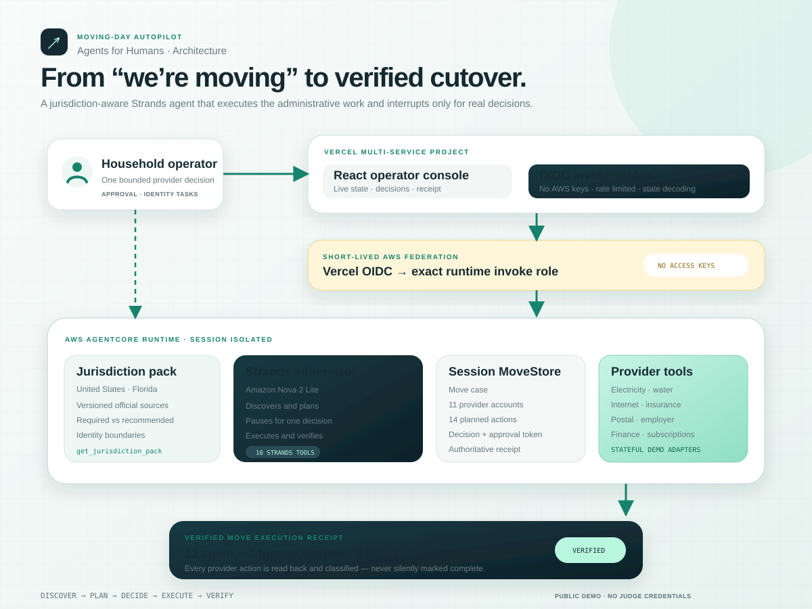

# Moving-Day Autopilot

**Move the household, not the administrative burden.**

[Live demo](https://moving-day-autopilot.vercel.app) · Built for the [Agents for Humans Hackathon](https://agentsforhumans.devpost.com/)

Moving-Day Autopilot is a jurisdiction-aware Strands agent that completes the administrative cutover of a household move across utilities, internet, insurance, address records, appointments, deposits, and final bills.

The agent runs the repetitive work in the background and interrupts the household only when a decision materially affects cost, service continuity, identity, or an irreversible cancellation. It never marks blocked work as complete.

## Reference outcome

The deterministic Florida scenario produces a measurable result:

```text
11 address-linked services discovered
14 dependency-aware actions planned
 1 bounded human decision
12 provider actions executed and verified
 2 identity-required household tasks preserved
 0 failed actions
 0 service gaps
```

## Architecture



The public application uses two Vercel services behind one domain:

- **Web:** React/Vite operator console.
- **Bridge:** Express service that invokes AgentCore using short-lived Vercel OIDC credentials.

The bridge has no AWS access keys. Its IAM role can invoke only the exact Moving-Day AgentCore runtime. The runtime hosts a session-isolated Strands agent backed by Amazon Nova 2 Lite and deterministic stateful provider adapters.

## Agent lifecycle

1. Read the versioned jurisdiction pack and official sources.
2. Discover address-linked services from the inbox and account registry.
3. Build a dependency-aware cutover plan.
4. Continue automatic branches while surfacing one bounded provider decision.
5. Reject approval-gated actions without the exact human decision token.
6. Execute authorized provider actions.
7. Read provider state back and classify every action as verified, blocked, or failed.
8. Produce a move execution receipt without hiding remaining household work.

## Strands tool surface

| Tool | Responsibility |
|---|---|
| `get_jurisdiction_pack` | Read versioned rules, sources, supported services, and identity boundaries |
| `discover_move_services` | Discover the household's address-linked services |
| `build_move_plan` | Build the dependency-safe administrative cutover |
| `get_move_state` | Read the authoritative session state |
| `record_move_decision` | Record the exact human provider choice and issue an approval token |
| `execute_move_plan` | Execute authorized work and reject missing or stale approval |
| `verify_move_completion` | Read providers back and issue the execution receipt |

## Source-aware jurisdiction packs

The MVP implements **United States / Florida** completely. Jurisdiction rules are isolated from universal move orchestration and carry:

- version and last-checked date;
- official source URL;
- required, recommended, or provider-specific classification;
- explicit human-identity boundary;
- supported service categories.

If a jurisdiction pack is unavailable, the agent must create a sourced guided task instead of applying Florida rules elsewhere.

## Security boundaries

- Browser clients never receive AWS credentials.
- Vercel federates to AWS through short-lived OIDC tokens.
- The Vercel role is scoped to one AgentCore runtime endpoint.
- AgentCore sessions receive separate MoveStore instances.
- Payments, identity actions, and irreversible cancellations remain human-gated.
- The public bridge validates session IDs, limits prompt size, and applies a best-effort rate limit.
- AWS budget alerts are configured independently of the application.

## Repository layout

```text
apps/web             React/Vite operator console
services/agent       Strands SDK service and AgentCore HTTP runtime
services/bridge      Vercel OIDC → AgentCore invoke bridge
packages/contracts   Shared schemas and Florida jurisdiction pack
agentcore             AgentCore/CDK runtime configuration
openspec/changes     Requirements, ADR, plan, and verification artifacts
docs                  Architecture and submission assets
```

## Local development

Requirements: Node.js 22+, npm, Docker, and an AWS profile with Bedrock access for live model tests.

```bash
npm install
npm run dev:agent
npm run dev --workspace @moving-day/web -- --host 127.0.0.1
```

The local UI uses deterministic REST endpoints. Production sets `VITE_AGENT_MODE=cloud` and drives the same shared state through the AgentCore runtime.

## Verification

```bash
npm run lint
npm run typecheck
npm test
npm run build
npm run test:e2e
AWS_PROFILE=moving-day AWS_REGION=us-east-1 npm run test:agent-live
```

The test suite covers contracts, jurisdiction-pack validation, approval gating, zero-gap and one-gap provider choices, AgentCore state decoding, responsive browser flow, and live Strands tool orchestration.

## Demo boundaries

All addresses, accounts, provider portals, confirmation codes, and move events are deterministic synthetic data. The agent modifies real state inside the demo provider adapters and verifies it, but it does not contact real utilities or government systems.

## License

[MIT](LICENSE)
